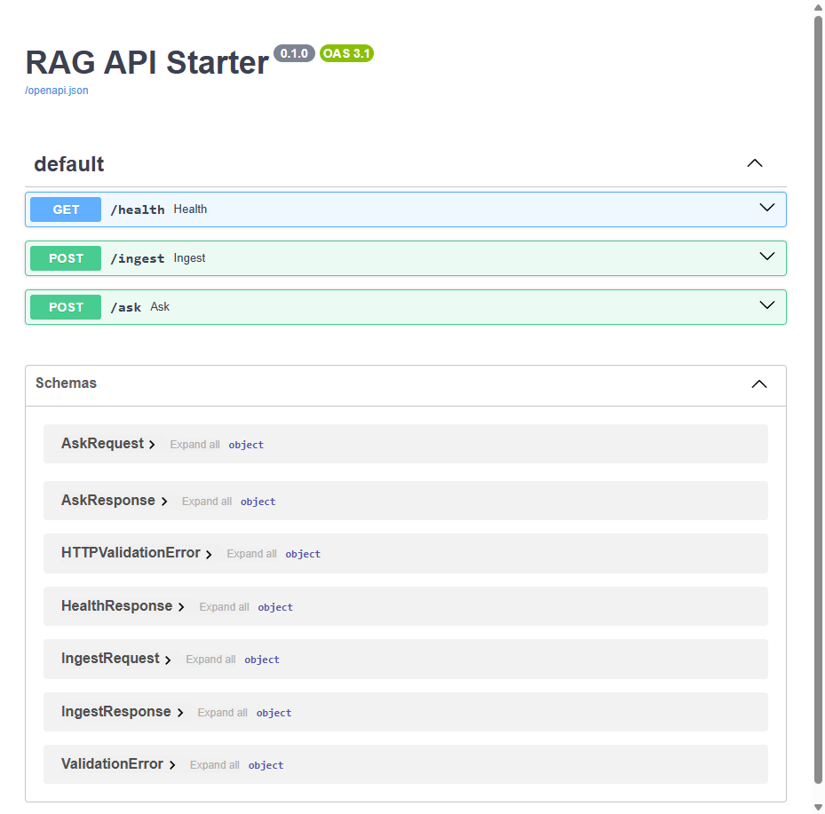
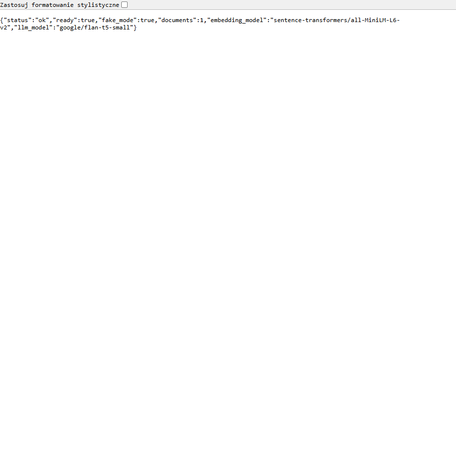

# RAG API Starter

Minimal, production-style MVP RAG service that works fully local with no paid APIs.

## MVP Scope (End-to-End)
- `POST /ingest` - upload a document (`.txt`) to the knowledge base
- `POST /ask` - ask a question and get `answer + sources`
- `GET /health` - readiness and index status

Stack:
- FastAPI
- Hugging Face embeddings (`sentence-transformers/all-MiniLM-L6-v2`)
- FAISS vector store (local disk)

## Live Proof (Swagger)
`/docs` running locally:



## Architecture
```text
              +---------------------------+
              |        Client/UI          |
              | curl / app / Swagger UI   |
              +-------------+-------------+
                            |
                            v
                 +----------+----------+
                 |      FastAPI API    |
                 | /ingest /ask /health|
                 +----------+----------+
                            |
            +---------------+----------------+
            |                                |
            v                                v
+-----------+-----------+          +---------+---------+
| Ingestion + Chunking  |          | Retrieval Service |
| Recursive splitter    |          | top_k + threshold |
+-----------+-----------+          +---------+---------+
            |                                |
            v                                v
+-----------+-----------+          +---------+---------+
| JSONL Knowledge Store |          |   FAISS Index     |
| data/knowledge.jsonl  |          |  data/index/      |
+-----------------------+          +-------------------+
```

## Run In 2 Minutes (Docker)
```bash
git clone https://github.com/danieloza/rag-api-starter.git
cd rag-api-starter
docker compose up --build
```

Open:
- `http://127.0.0.1:8010/docs`
- `http://127.0.0.1:8010/health`

## Run Locally (Python)
```bash
git clone https://github.com/danieloza/rag-api-starter.git
cd rag-api-starter
python -m venv .venv
```

Activate virtual environment:
```bash
# macOS/Linux
source .venv/bin/activate

# Windows PowerShell
.\.venv\Scripts\Activate.ps1
```

Install and run:
```bash
pip install -r requirements.txt
cp .env.example .env
uvicorn app.main:app --host 127.0.0.1 --port 8010 --reload
```

Windows alternative for env copy:
```powershell
Copy-Item .env.example .env
```

Open:
- `http://127.0.0.1:8010/docs`
- `http://127.0.0.1:8010/health`

Retrieval tuning lives in `.env`:
- `RETRIEVAL_K`
- `RETRIEVAL_SCORE_THRESHOLD`
- `MAX_TOP_K`

## End-to-End Demo Flow
Upload a document:
```bash
curl -X POST http://127.0.0.1:8010/ingest \
  -F "file=@docs/sample.txt" \
  -F "source=portfolio"
```

Ask a question:
```bash
curl -X POST http://127.0.0.1:8010/ask \
  -H "Content-Type: application/json" \
  -d '{"question":"What does Daniel build?","top_k":3}'
```

PowerShell examples:
```powershell
curl.exe -X POST "http://127.0.0.1:8010/ingest" -F "file=@docs/sample.txt" -F "source=portfolio"
Invoke-RestMethod -Method Post -Uri http://127.0.0.1:8010/ask -ContentType 'application/json' -Body '{"question":"What does Daniel build?","top_k":3}'
```

## Demo Proof
Health endpoint:



## Smoke Tests
```bash
pip install -r requirements-dev.txt
pytest -q
```

## Trade-offs
- `FAISS` over `Chroma`: zero external service and fast local startup; less convenient metadata filtering and persistence UX than full DB-backed options.
- `all-MiniLM-L6-v2` embeddings: good speed/quality for laptop CPU; lower semantic quality than larger embedding models.
- `chunk_size=400`, `chunk_overlap=60`: balanced recall and latency for short business docs; longer docs may need bigger chunks or hierarchical retrieval.
- Basic answer assembly from retrieved snippets: predictable and cheap, but no generation-grade reasoning or synthesis yet.

## Roadmap
- Add reranking step (`cross-encoder`) after initial vector retrieval for better precision.
- Add query/result cache (Redis or in-memory TTL) to reduce repeated retrieval cost.
- Add auth layer (API key or JWT) and per-tenant document isolation.
- Add background ingestion queue for bigger files and async indexing.
- Add richer eval set and regression benchmarks for retrieval quality.

## API Contracts
- `POST /ingest` (multipart form)
  - `file` (required for document upload)
  - `source` (optional string)
- `POST /ask` (JSON)
  - `question` (required)
  - `top_k` (optional, default from config)

Example `/ask` response:
```json
{
  "answer": "Based on retrieved context: ...",
  "sources": ["portfolio"],
  "used_top_k": 3
}
```

## Project Structure
- `app/main.py` - FastAPI routes
- `app/rag_service.py` - ingestion, indexing, retrieval, answer assembly
- `app/settings.py` - runtime config
- `app/schemas.py` - response/request models
- `data/` - local FAISS index + knowledge store

## Release and License
- Releases: `v0.1.0` (initial), `v0.1.1` (latest)
- License: `MIT` (see `LICENSE`)
- Changelog: `CHANGELOG.md`
